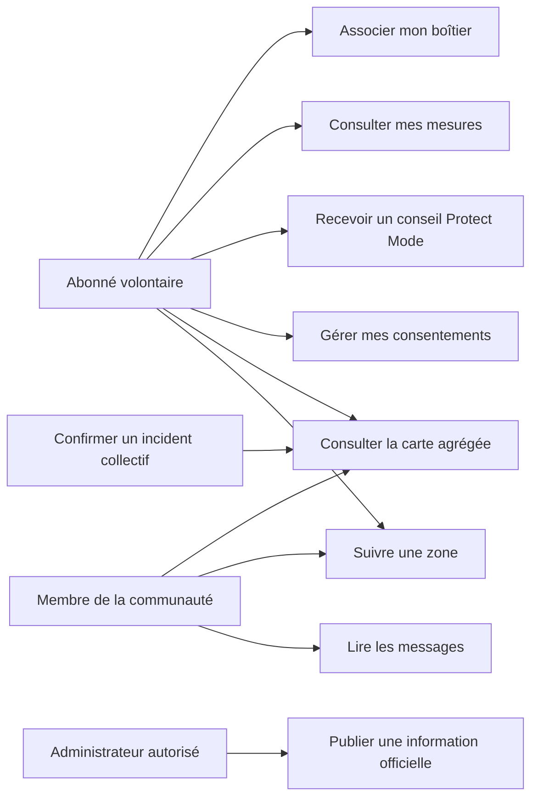
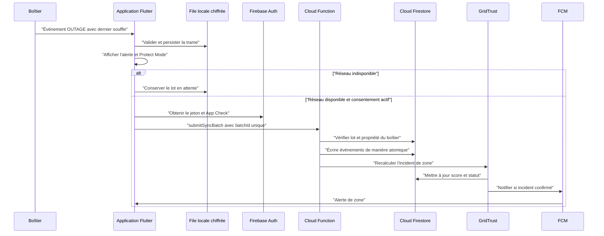
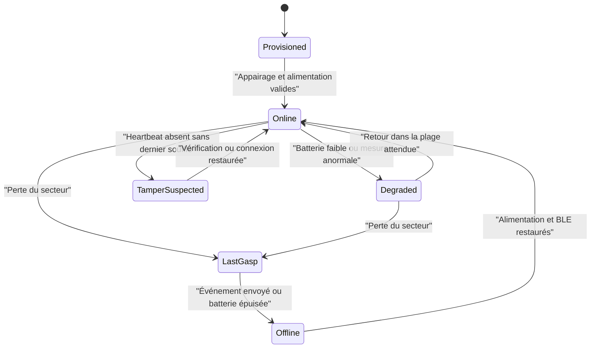
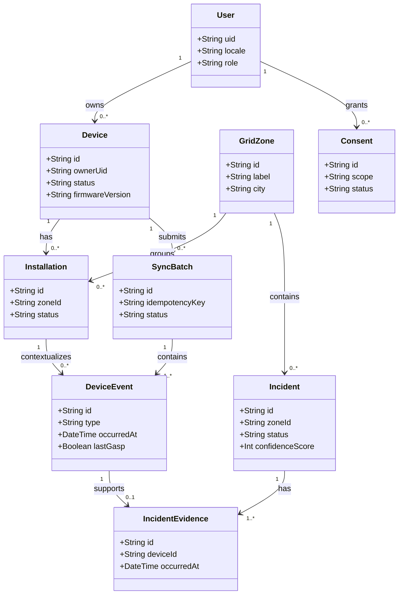
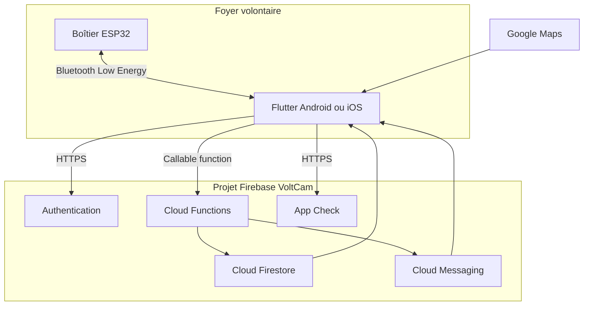

# Diagrammes UML — VoltCam Standard (Flutter + Firebase)

Les diagrammes sont maintenus en Mermaid afin de rester versionnables. Ils décrivent le MVP Flutter/Firebase et conservent les invariants de sécurité de VoltCam.

## 1. Cas d'utilisation



## 2. Diagramme de composants

```mermaid
flowchart LR
    sensor["Chaîne de mesure isolée"] --> device["Boîtier VoltCam"]
    battery["Batterie de secours"] --> device
    device -->|"BLE GATT"| flutterApp["Application Flutter"]
    flutterApp --> localStore["Stockage local chiffré"]
    flutterApp --> firebaseAuth["Firebase Auth et App Check"]
    flutterApp --> callable["Cloud Functions callable"]
    callable --> firestore["Cloud Firestore"]
    callable --> gridTrust["Moteur GridTrust"]
    gridTrust --> firestore
    gridTrust --> fcm["Firebase Cloud Messaging"]
    firestore --> flutterApp
    fcm --> flutterApp
    maps["Google Maps"] --> flutterApp
    config["Remote Config"] --> flutterApp
    crashlytics["Crashlytics"] <-- flutterApp
    officialSource["Source officielle autorisée"] --> callable
```

## 3. Séquence : coupure confirmée



## 4. Machine à états du boîtier



## 5. Modèle de domaine



## 6. Déploiement logique



## 7. Invariants à préserver

- Le client Flutter ne peut pas écrire directement un incident public, une preuve ou un message officiel.
- Un identifiant de lot idempotent ne peut être traité qu'une fois.
- Une preuve d'incident provient d'un boîtier associé à la zone au moment de l'événement.
- Un incident public ne contient aucun identifiant matériel, foyer ou échantillon brut.
- Le retrait de consentement coupe les synchronisations futures de la portée concernée, tout en conservant l'audit minimal requis.
