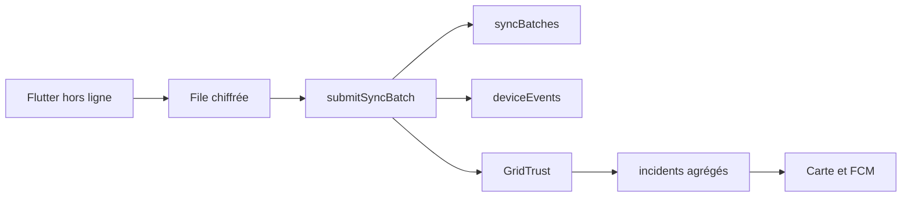

# Modèle de données Firestore — VoltCam Standard

## 1. Principes

Cloud Firestore est la source de vérité du MVP hackathon. Le modèle privilégie des documents petits, des vues de lecture simples et des écritures sensibles gérées par Cloud Functions.

La télémétrie brute fréquente ne va pas dans Firestore : elle reste dans le stockage local chiffré, puis est résumée en événements à faible volume.

## 2. Collections principales

| Collection | Écriture | Lecture client | Rôle |
| --- | --- | --- | --- |
| `users/{uid}` | Client limité ou Function | Propriétaire | Profil et préférences. |
| `devices/{deviceId}` | Function | Non directe | Provisionnement, propriétaire et état serveur. |
| `installations/{installationId}` | Function | Non directe | Lien historique boîtier, zone et consentement. |
| `syncBatches/{batchId}` | Function | Non directe | Idempotence et résultat de synchronisation. |
| `deviceEvents/{eventId}` | Function | Non directe | Événements techniques minimisés. |
| `zones/{zoneId}` | Admin Function | Authentifié | Métadonnées de zone et carte agrégée. |
| `incidents/{incidentId}` | Function | Authentifié | Vue publique agrégée et score GridTrust. |
| `incidents/{id}/evidence/{eventId}` | Function | Non directe | Preuves internes d'incident. |
| `maintenanceWindows/{id}` | Admin Function | Authentifié | Maintenances officielles. |
| `communityPosts/{id}` | Function | Authentifié, si publié | Messages communautaires ou officiels. |
| `users/{uid}/notifications/{id}` | Function | Propriétaire | Alertes personnelles. |
| `consents/{id}` | Function | Non directe | Historique de consentement versionné. |
| `auditLogs/{id}` | Function | Non directe | Traçabilité de sécurité et administration. |

## 3. Documents représentatifs

### `devices/{deviceId}` — privé serveur

```json
{
  "ownerUid": "firebase-uid",
  "hardwareId": "VTC-2026-DEMO-001",
  "status": "ONLINE",
  "firmwareVersion": "1.0.0",
  "lastSeenAt": "serverTimestamp"
}
```

### `syncBatches/{batchId}` — idempotence

```json
{
  "ownerUid": "firebase-uid",
  "deviceId": "VTC-2026-DEMO-001",
  "installationId": "installation-demo-001",
  "payloadHash": "sha256",
  "status": "ACCEPTED",
  "eventCount": 1,
  "receivedAt": "serverTimestamp",
  "result": {
    "incidentIds": ["incident-biyem-assi-20260724-01"]
  }
}
```

### `deviceEvents/{eventId}` — privé serveur

```json
{
  "deviceId": "VTC-2026-DEMO-001",
  "installationId": "installation-demo-001",
  "zoneId": "yaounde-vi-biyem-assi",
  "syncBatchId": "b8a2aee4-481d-48c6-a242-3c84b2dbce2e",
  "type": "OUTAGE",
  "occurredAt": "2026-07-24T10:11:58Z",
  "lastGasp": true,
  "summary": {
    "voltageBeforeLoss": 218.7,
    "batteryPercent": 93
  }
}
```

### `incidents/{incidentId}` — agrégé public

```json
{
  "zoneId": "yaounde-vi-biyem-assi",
  "type": "OUTAGE",
  "status": "CONFIRMED",
  "startedAt": "2026-07-24T10:11:58Z",
  "confidenceScore": 94,
  "independentDeviceCount": 8,
  "publicSummary": "Coupure confirmée par plusieurs boîtiers de la zone.",
  "mapLayer": "OUTAGES",
  "updatedAt": "serverTimestamp"
}
```

## 4. Invariants serveur

1. `batchId` est unique et associé à une empreinte de payload immuable.
2. Un `deviceEvent` appartient au boîtier et à l'installation actifs au moment de `occurredAt`.
3. Une preuve ne peut contribuer qu'à un seul incident actif de même type dans la fenêtre GridTrust.
4. Le compteur `independentDeviceCount` compte des boîtiers distincts, pas des événements bruts.
5. Un document `incident` public ne contient aucune référence de foyer ou de boîtier.
6. Les Cloud Functions, jamais le client Flutter, écrivent preuves, incidents, compteurs, scores et contenus officiels.

## 5. Limites et coût Firestore

- Limiter les lots à un nombre d'événements compatible avec les transactions et écritures groupées.
- Garder les documents sous la limite Firestore et tronquer ou rejeter les métadonnées non prévues.
- Indexer seulement les requêtes réelles : incidents de zone, maintenances et publications.
- Paginer les listes de carte, messages et notifications.
- Superviser les lectures, écritures et suppressions par environnement Firebase.
- Utiliser une exportation analytique future si le pilote nécessite un historique de mesures à haute fréquence.

## 6. Cycle d'écriture


